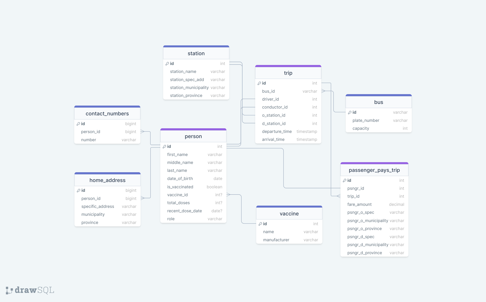

# Bus Passenger Tracker Database

### by Hannah Bella C. Arceño

## ✨ Description ✨

Bus Passenger Tracker Database is a MySQL database designed for contact tracing of bus passengers. This is a revision of a database systems project, prompted by the need for a systematic process of tracking people potentially infected by COVID-19.

## ✨ Tasks ✨

- [x] Revise application domain
- [x] Create entity-relationship diagrams
- [x] Create database (DDL)
- [ ] Create queries (DML)
  - [x] Create view for all employees
  - [ ] Get passenger full name and vaccination status in a specific trip
  - [ ] Find all people (passenger, driver, conductor) who made contact with person=''
    - [ ] Identify id of person
    - [ ] Find their origin and destination
    - [ ] Find trip(s) they went to, order by date, most recent
    - [ ] Find people who went on the same trip as them
    - [ ] Find people who had the same destination
  - [ ] Create sample store procedures
    - [ ] Find all trips from origin='' on date=''

> - Supplemental Learning
> - [ ] Find ways to practice ALTER, UPDATE, PARTITION, PROCEDURE
> - [ ] Create an INDEX, and STORED PROCEDURE

## 🌠 Reproduce this database into your local machine! 🌠

1. Run the SQL instructions included in `create_db.sql` into a MySQL shell or workbench to create the database.

2. You may add your data on your own or make use of commands included in `add_sample_data.sql`.
